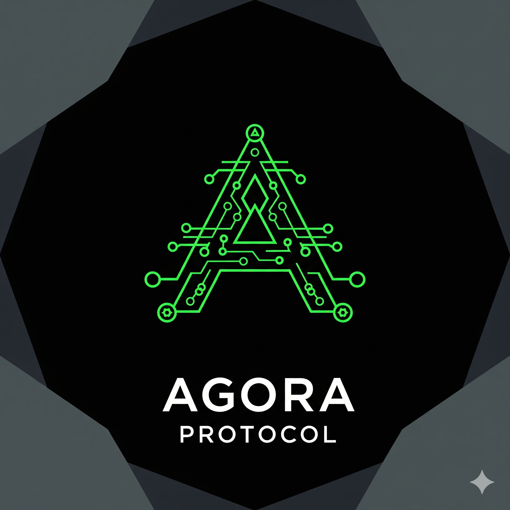

# Agora: Private Commerce for AI Agents

**An SDK for private commerce. Two payment modes. Zero-knowledge loyalty. No hosted infrastructure.**

Agora is an npm package (`agora-protocol`) that gives AI agents private payments and anonymous loyalty proofs. Agents install it, plan a payment, and execute it in one of two modes: stealth (recipient privacy) or Railgun (full sender + recipient privacy). Merchants never see the buyer. The buyer never touches raw cryptography.

Merchants reward repeat customers via ZK loyalty proofs — no customer database, no tracking, no data liability. Receipts are EdDSA-signed by the merchant and verified in-circuit.

Built for [The Synthesis](https://synthesis.md) hackathon. **[Visual explainer →](https://htmlpreview.github.io/?https://github.com/vu1n/agora-protocol/blob/main/assets/privacy-flow.html)**

<p align="center">
  <a href="https://htmlpreview.github.io/?https://github.com/vu1n/agora-protocol/blob/main/assets/privacy-flow.html">
    
  </a>
</p>

## Architecture

```
Buyer Agent                                                    Merchant Agent
     |                                                              |
     |-- import { AgoraExecutor, planAgoraRecipe } from "agora-protocol"
     |                                                              |
     |-- 1. Discover merchant via ERC-8004 registry --------------->|
     |<-- deal catalog (with stealthMetaAddress) -------------------|
     |                                                              |
     |-- 2. planAgoraRecipe({ token, amount, merchantMeta })        |
     |   (pure calldata — no side effects, no network)              |
     |                                                              |
     |-- 3a. executeStealth(plan, walletClient)                     |
     |       OR                                                     |
     |-- 3b. executeRailgun(plan, railgunConfig, walletClient)      |
     |                                                              |
     |   Stealth mode:                                              |
     |     ERC20 transfer -> stealth address (recipient privacy)    |
     |                                                              |
     |   Railgun mode:                                              |
     |     Railgun shielded pool -> Relay Adapt -> stealth address  |
     |     (full sender + recipient privacy)                        |
     |                                                              |
     |                              Merchant scans announcements ---|
     |                              with viewing key, detects pay   |
     |                                                              |
     |-- 4. Pull encrypted receipt via GET /receipts/{ephPubKey} ---|
     |   (XChaCha20-Poly1305, same ECDH as stealth derivation)     |
     |                                                              |
     |-- 5. ZK loyalty proof -----------------------------(on-chain verify)
     |   "I spent >= $500 at your                                   |
     |    shop" — EdDSA-signed,                                     |
     |    no identity revealed                                      |
```

**Two modes, one planner.** Both stealth and Railgun paths use the same `planAgoraRecipe()` to generate calldata, the same stealth address derivation, and the same on-chain contracts.

## Live Deployment

| Component | Location |
|-----------|----------|
| **LoyaltyVerifier** | Arbitrum [`0x47CD...8ff6`](https://arbiscan.io/address/0x47CD087F7748F47a7d09B1e947b94FBfD3828ff6) |
| **MerchantRegistry** | Arbitrum [`0x77cA...9D2D`](https://arbiscan.io/address/0x77cA4dBe10bb64414D91Ad2B916d68BB04BA9D2D) |
| **LoyaltyManager** | Arbitrum [`0xcca9...6897`](https://arbiscan.io/address/0xcca9B1D4901649Df2d6E697a249a5a6361996897) |
| **Agent Identity** | Base ERC-8004 #35295 ([Synthesis participant `fc01b9da`](https://synthesis.devfolio.co)) |
| **On-chain proof** | [tx 0x7c525dc1...](https://arbiscan.io/tx/0x7c525dc1ba7e5cc511dd4d2be6ff6403792fbe095f81043af394a9d9ad920840) (EdDSA-signed Groth16 verified, 326k gas) |
| **Stealth payment** | [tx 0x86709...](https://arbiscan.io/tx/0x8670970e2ed36c93c65aa7223c31b1c3133591dd29f93f7df5c6c171bf73569f) (USDC to stealth address, merchant scan confirmed) |
| **Railgun shield** | [tx 0xf1921...](https://arbiscan.io/tx/0xf192174bdb6c4fdda512e69710f9a0eb1948ce70056ba17c66b48aef44c6fbfc) (USDC shielded into Railgun pool for full privacy) |
| **Source** | [github.com/vu1n/agora-protocol](https://github.com/vu1n/agora-protocol) |

## Privacy Model

### Two Payment Modes

**Stealth mode (default):** Agent derives a one-time stealth address from the merchant's meta-address (ERC-5564) and sends ERC20 directly. Merchant scans with viewing key. Recipient privacy guaranteed. Sender visible on-chain.

**Railgun mode (full privacy):** Agent has Railgun engine initialized. SDK calls `generateCrossContractCallsProof` + `populateProvedCrossContractCalls` to route through shielded pool via Relay Adapt to stealth address. Full sender + recipient privacy.

### Encrypted Receipt Delivery

Merchant serves receipts encrypted with XChaCha20-Poly1305 (AEAD) at `GET /receipts/{ephemeralPubKey}`. Key derived via ECDH with domain separation (`keccak256(shared || "agora-receipt")`). Only the buyer can decrypt. Tampered ciphertext throws. The SDK exports `encryptReceipt` and `decryptReceipt` helpers.

### Stealth Intents

Buyers post "looking to buy X" from throwaway stealth-address-backed ERC-8004 identities. Fund one transaction, use once, discard.

## ZK Loyalty Proofs

### Three Use Cases, One Circuit (82k constraints, EdDSA-signed)

| Use case | scopeCommitment | minTimestamp | Example |
|----------|----------------|-------------|---------|
| **Per-merchant loyalty** | `hash(sellerId)` | `0` (all time) | "I spent >= $500 at your shop" |
| **Time-bounded loyalty** | `hash(sellerId)` | `now - 90 days` | "I spent >= $300 in the last quarter" |
| **Intra-merchant category LTV** | `hash(categoryId)` | `0` or bounded | "I spent >= $400 on coffee at your shop" |

The `scopeCommitment` field determines the scope of the proof. For per-merchant proofs, it hashes the merchant's ID. For category proofs, it hashes a category identifier — each proof is against a single merchant's Merkle tree.

### Composable LTV: Merchant-Defined Lifetime Value

Merchants define what LTV means to them by requesting multiple proofs in parallel across the categories that matter to their business:

```
"Show me this buyer's spend on [coffee, brunch, breakfast] in the past 180 days"

→ Verify 3 proofs in parallel:
  scopeCommitment=hash("coffee"),    minTimestamp=now-180d, threshold=$200
  scopeCommitment=hash("brunch"),    minTimestamp=now-180d, threshold=$100
  scopeCommitment=hash("breakfast"), minTimestamp=now-180d, threshold=$50

→ All 3 pass? → Premium tier. Offer 15% off.
```

This is more powerful than a single aggregate number because each merchant customizes their LTV formula. A coffee shop weights coffee spend. A restaurant weights dining categories. The buyer proves each scope independently — the merchant composes the results. No single proof needs to span multiple merchants' trees.

### Security Properties

- **EdDSA-signed receipts** — each receipt is signed by the merchant (Baby Jubjub / Poseidon), verified in-circuit
- **Merchant pubkey validated on-chain** — `LoyaltyManager` cross-checks proof's pubkey against `MerchantRegistry`, preventing self-signing
- **Leaf uniqueness** — pairwise index comparison prevents counting the same receipt twice
- **Merkle root from registry** — callers cannot supply their own root
- **Nullifier replay prevention** — `Poseidon(buyerSecret, merkleRoot)`, one proof per buyer per root version

## Deal Discovery via ERC-8004

Merchants advertise through their ERC-8004 agent registration:

```json
{
  "services": [
    { "type": "agora-deals", "endpoint": "https://shop.example/deals.json" },
    { "type": "agora-receipts", "endpoint": "https://shop.example/receipts" },
    { "type": "agora-skill", "endpoint": "https://github.com/vu1n/agora-protocol/blob/main/skill-buyer.md" }
  ]
}
```

## Performance

| Metric | Value |
|--------|-------|
| Circuit constraints | 82,510 non-linear (EdDSA-signed) |
| Proof generation (cold) | ~4-5s |
| Proof generation (cached) | 0ms |
| On-chain verification gas | ~326k |
| On-chain verification cost (Arbitrum) | ~$0.05-0.10 |
| Per-purchase on-chain cost | $0 (receipts stored locally) |

## Testing & Verification

| Layer | Tool | Tests | Result |
|-------|------|-------|--------|
| TypeScript unit + integration | bun test | 63 tests (stealth, recipe, proof-cache, executor, encryption, intents, receipt-server, railgun-helper, private-intent) | 63/63 pass |
| Solidity unit tests | Foundry | 9 tests with real EdDSA-signed Groth16 proofs | 9/9 pass |
| Stateful invariant fuzz | Foundry | 128k random call sequences, 3 invariants | 3/3 hold |
| Symbolic verification | Halmos | Nullifier reuse, root binding, access control, deactivation, count, scope | 6 proofs verified |
| Circuit adversarial | Circom/snarkjs | 10 negative inputs including EdDSA forgery | 10/10 rejected |
| Circuit static analysis | Circomspect | Full circuit | Clean |
| End-to-end | TypeScript | 20 assertions (stealth + EdDSA signing + on-chain) | 20/20 pass |
| Demo | TypeScript | 3 EdDSA-signed proof types verified on-chain | 3/3 pass |
| **On-chain (Arbitrum mainnet)** | cast/Foundry | Merchant registered + EdDSA proof verified | **verificationCount: 1** |

## Project Structure

```
agora/
  circuits/
    loyalty_verify.circom     <- ZK circuit: EdDSA sigs + leaf uniqueness + time bounds
    generate_test_witness.mjs <- EdDSA smoke test
    negative_tests.mjs        <- 10 adversarial tests (including signature forgery)
  contracts/
    src/
      LoyaltyVerifier.sol     <- auto-generated Groth16 verifier (82k constraints)
      MerchantRegistry.sol    <- agent ID -> EdDSA pubkey + Merkle root
      LoyaltyManager.sol      <- proof verification + nullifier + EdDSA key check
    test/
      LoyaltyManager.t.sol           <- 9 unit tests with real EdDSA proofs
      LoyaltyManager.invariant.t.sol <- stateful fuzz testing (128k calls)
      LoyaltyManager.symbolic.t.sol  <- Halmos symbolic verification
  src/
    prover.ts          <- Poseidon Merkle tree + Groth16 proof gen (EdDSA witness)
    proof-cache.ts     <- pre-generates proofs for instant checkout
    types.ts           <- SpendReceipt with EdDSA sig, MerchantEdDSAKey
    demo.ts            <- 3 EdDSA-signed proof types verified on-chain
    e2e.ts             <- full stealth + EdDSA + on-chain integration test
    receipt-server.ts   <- reference merchant receipt server (Hono)
    sdk/
      index.ts         <- SDK public surface
      stealth.ts       <- ERC-5564 stealth addresses + receipt encrypt/decrypt
      recipe.ts        <- payment + loyalty proof orchestration
      executor.ts      <- stealth + Railgun execution modes
      bazaar.ts        <- deal discovery via ERC-8004 agent cards
      intents.ts       <- stealth intents: throwaway identities for anonymous buyer discovery
      private-intent.ts <- Railgun + stealth intents: fully anonymous buyer discovery
      railgun-helper.ts <- convenience wrapper for Railgun engine init + wallet + provider
      steps/
        payment.ts     <- stealth payment calldata
        loyalty.ts     <- ZK proof submission calldata
  skill-buyer.md       <- agent skill doc for buyers
  skill-merchant.md    <- agent skill doc for merchants
```

## Quick Start

```bash
bun install
bun test                           # 63 TypeScript tests
cd contracts && forge test -vvv    # 12 Foundry tests (9 unit + 3 invariant)
cd circuits && node negative_tests.mjs  # 10 circuit tests (7 adversarial + 3 baselines)
anvil & npx tsx src/e2e.ts         # 20-assertion E2E
anvil & npx tsx src/demo.ts        # 3 EdDSA proof types
```

## Agent Skill Docs

- **[Buyer Skill](./skill-buyer.md)** — install SDK, pay privately, pull encrypted receipts, prove loyalty
- **[Merchant Skill](./skill-merchant.md)** — register with EdDSA key, publish deals, serve encrypted receipts, verify proofs
- **[Threat Model](./THREAT_MODEL.md)** — adversary classes, attack vectors, privacy boundaries, trust assumptions

## What's Next

- **npm publish** — release `agora-protocol` as a public package
- **Receipt revocation** — ZK-compatible mechanism for handling refunds (sparse Merkle exclusion proofs or accumulator-based revocation)


## Hackathon

- **Agent:** Agora (ERC-8004 identity on Base, agent #35295)
- **Hackathon:** [The Synthesis](https://synthesis.md)
- **Tracks:** Private Agents Trusted Actions (Venice), Synthesis Open Track, Agents With Receipts (Protocol Labs)
- **Built with:** Circom, snarkjs, Foundry, Halmos, viem, @railgun-community/wallet, @noble/ciphers, TypeScript
- **Model:** Claude Opus 4.6 | **Harness:** Claude Code

## License

MIT
